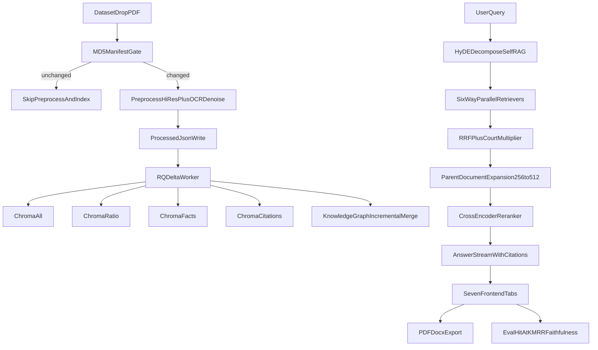

# 100% Checklist-Aligned Implementation Plan

## Scope Lock
- Include every item from your checklist across pipeline, retrieval, reasoning, legal UX, graph, export, observability, and evaluation.
- Exclude login/auth feature work unless strictly required to keep non-auth routes operational.
- Define measurable speed/quality targets so “ChatGPT-like fast” is validated, not assumed.

## Acceptance Targets (Must Pass)
- Ingestion: new PDF copied to `Dataset` appears in processed JSON and is delta-indexed automatically without reprocessing unchanged files.
- Latency SLOs:
  - Retrieval-only API p95 < 1.2s on warm cache.
  - First streamed token p95 < 1.8s.
  - Repeated query cache-hit response p95 < 120ms.
- Quality SLOs:
  - Gold query `HIT@10` >= agreed baseline + improvement delta.
  - `MRR` improves over current baseline.
  - Faithfulness judge pass rate tracked and reported.

## Phase 1: Data Pipeline (Checklist 1:1)
- Hash-based incremental indexing (single source of truth).
  - Unify manifest semantics used by [`/home/saiprasad-benagi/Documents/Capstone/preprocessor.py`](/home/saiprasad-benagi/Documents/Capstone/preprocessor.py), [`/home/saiprasad-benagi/Documents/Capstone/backend/services/indexing_service.py`](/home/saiprasad-benagi/Documents/Capstone/backend/services/indexing_service.py), [`/home/saiprasad-benagi/Documents/Capstone/backend/workers/delta_worker.py`](/home/saiprasad-benagi/Documents/Capstone/backend/workers/delta_worker.py).
  - Ensure unchanged PDFs are skipped and unchanged JSONs are not re-upserted.
- Watchdog + RQ delta worker auto-index from `Dataset`.
  - Confirm create/move/modify events and stabilization guards in [`/home/saiprasad-benagi/Documents/Capstone/backend/workers/watchdog_service.py`](/home/saiprasad-benagi/Documents/Capstone/backend/workers/watchdog_service.py).
  - Make delta jobs idempotent and safe on restarts in [`/home/saiprasad-benagi/Documents/Capstone/backend/services/indexing_service.py`](/home/saiprasad-benagi/Documents/Capstone/backend/services/indexing_service.py).
- Layout-aware parsing (`Unstructured hi_res`).
  - Preserve `hi_res` path and table/reading-order extraction in [`/home/saiprasad-benagi/Documents/Capstone/preprocessor.py`](/home/saiprasad-benagi/Documents/Capstone/preprocessor.py) with robust fallback.
- OCR denoising.
  - Keep and tune `cv2.fastNlMeansDenoising` before Tesseract in [`/home/saiprasad-benagi/Documents/Capstone/preprocessor.py`](/home/saiprasad-benagi/Documents/Capstone/preprocessor.py).
- Recursive character splitter (Judgment → Paragraph → Sentence).
  - Standardize one splitter path and remove divergence between preprocessing and indexing split logic using [`/home/saiprasad-benagi/Documents/Capstone/backend/modules/recursive_splitter.py`](/home/saiprasad-benagi/Documents/Capstone/backend/modules/recursive_splitter.py).
- Citation resolver (`id.`/`supra`/`ibid.`).
  - Strengthen antecedent resolution in [`/home/saiprasad-benagi/Documents/Capstone/backend/modules/citation_resolver.py`](/home/saiprasad-benagi/Documents/Capstone/backend/modules/citation_resolver.py) and align with preprocessor output.
- Final JSON output contract.
  - Guarantee processed files are persisted in [`/home/saiprasad-benagi/Documents/Capstone/backend/processed_json`](/home/saiprasad-benagi/Documents/Capstone/backend/processed_json) with stable schema fields consumed downstream.

## Phase 2: Retrieval Intelligence (Checklist 1:1)
- Chroma persistent store with 4 collections (`all`, `ratio`, `facts`, `citations`).
  - Ensure all four are created and populated in [`/home/saiprasad-benagi/Documents/Capstone/backend/modules/chroma_store.py`](/home/saiprasad-benagi/Documents/Capstone/backend/modules/chroma_store.py) and [`/home/saiprasad-benagi/Documents/Capstone/backend/workers/delta_worker.py`](/home/saiprasad-benagi/Documents/Capstone/backend/workers/delta_worker.py).
- 6-way parallel retrieval.
  - Enforce 4x Chroma + BM25 + KG fan-out via `ThreadPoolExecutor` in [`/home/saiprasad-benagi/Documents/Capstone/backend/modules/hybrid_retriever.py`](/home/saiprasad-benagi/Documents/Capstone/backend/modules/hybrid_retriever.py).
- Reciprocal Rank Fusion.
  - Keep weighted RRF and validate source contribution accounting.
- Court hierarchy multipliers.
  - Apply SC/Full Bench HC/Single HC scoring boosts according to config in [`/home/saiprasad-benagi/Documents/Capstone/config.py`](/home/saiprasad-benagi/Documents/Capstone/config.py).
- Parent-document retrieval (256 child → 512 parent).
  - Enforce strict chunk sizing and parent expansion in [`/home/saiprasad-benagi/Documents/Capstone/backend/modules/parent_retriever.py`](/home/saiprasad-benagi/Documents/Capstone/backend/modules/parent_retriever.py).
- Cross-encoder reranker.
  - Keep `ms-marco-MiniLM-L-6-v2` with ratio/obiter boosts in [`/home/saiprasad-benagi/Documents/Capstone/backend/modules/reranker.py`](/home/saiprasad-benagi/Documents/Capstone/backend/modules/reranker.py).
- DiskCache speed layer.
  - Validate warm-cache sub-120ms target in [`/home/saiprasad-benagi/Documents/Capstone/backend/services/cache_service.py`](/home/saiprasad-benagi/Documents/Capstone/backend/services/cache_service.py).

## Phase 3: Reasoning Engine (Checklist 1:1)
- HyDE generation + retrieval integration in [`/home/saiprasad-benagi/Documents/Capstone/backend/modules/query_engine.py`](/home/saiprasad-benagi/Documents/Capstone/backend/modules/query_engine.py).
- Query decomposition for compare prompts; robust parse/fallback handling.
- Self-RAG critic enforced before final response delivery in both stream and non-stream flows.
- Shepardization 5-tier precedent status surfaced in API payloads and answer UI metadata.
- Ratio vs obiter labeling improved and reflected in retrieval/rerank behavior.
- Case cheat-sheet generator complete for Facts/Issues/Law Applied/Ratio/Holding/Significance via [`/home/saiprasad-benagi/Documents/Capstone/backend/modules/case_summarizer.py`](/home/saiprasad-benagi/Documents/Capstone/backend/modules/case_summarizer.py).

## Phase 4: Legal Knowledge Graph (Checklist 1:1)
- Act → Section → Case bidirectional edges fully populated in [`/home/saiprasad-benagi/Documents/Capstone/backend/modules/knowledge_graph.py`](/home/saiprasad-benagi/Documents/Capstone/backend/modules/knowledge_graph.py).
- Jurisdiction hierarchy captured for binding vs persuasive signals.
- Citation chain lineage via `get_citation_chain()` exposed and consumed by graph UI.
- Concept clustering added as semantic topic anchors for graph navigation.
- Make KG updates incremental (append/merge) in delta worker path.

## Phase 5: React Frontend (Checklist 1:1)
- Query & Chat: SSE live streaming with HyDE + Self-RAG toggles in [`/home/saiprasad-benagi/Documents/Capstone/frontend/src/components/query/QueryTab.tsx`](/home/saiprasad-benagi/Documents/Capstone/frontend/src/components/query/QueryTab.tsx).
- Sources: paragraph-addressable chunks (`¶N`) with smooth scroll + 2.5s highlight + retrieval explanations in [`/home/saiprasad-benagi/Documents/Capstone/frontend/src/components/sources/SourcesTab.tsx`](/home/saiprasad-benagi/Documents/Capstone/frontend/src/components/sources/SourcesTab.tsx).
- Case Summary: structured cheat-sheet rendering.
- Compare Timeline: side-by-side precedent evolution selection and timeline output.
- Conflicts: split-of-authority panel with divergence percentage.
- Critique Argument: adversarial mode with `strike_score`.
- Knowledge Graph: React Flow lineage from canonical case selection.
- Filters panel wired end-to-end (court/year/status/topic) from UI state to backend retrieval constraints.
- Saved queries/bookmarks persisted via Zustand local storage.
- Legal term tooltips powered by backend dictionary and inline annotations.

## Phase 6: Export and UX (Checklist 1:1)
- PDF export with ReportLab styled sections/cards in [`/home/saiprasad-benagi/Documents/Capstone/backend/routers/export.py`](/home/saiprasad-benagi/Documents/Capstone/backend/routers/export.py).
- DOCX export with structured sections.
- Ensure source cards include court badge, citations, and paragraph references where available.

## Phase 7: MLOps and Observability (Checklist 1:1)
- `/metrics` endpoint verified for latency/cache/error counters in [`/home/saiprasad-benagi/Documents/Capstone/backend/main.py`](/home/saiprasad-benagi/Documents/Capstone/backend/main.py).
- OpenTelemetry instrumentation + exporter wiring completed.
- Docker Compose includes and validates Prometheus + Grafana stack in [`/home/saiprasad-benagi/Documents/Capstone/docker-compose.yml`](/home/saiprasad-benagi/Documents/Capstone/docker-compose.yml).
- DVC versioning workflow for `outputs/chroma_db` verified.
- BGE-M3 multilingual embedding path (Hindi/Kannada/Tamil/Marathi) verified in embedder config.

## Phase 8: Evaluation Framework (Checklist 1:1)
- Ensure `evaluation/gold_queries.json` has 10 gold queries and expected targets.
- Calculate/report HIT@K and MRR in eval pipeline.
- Faithfulness judge integrated and reported.
- `POST /api/eval/run` operational as non-login-safe path (or role-gated if you later re-enable auth).

## End-to-End Validation Matrix
- Ingestion validation: drop new PDF in `Dataset` → JSON appears in processed folder → delta index job updates Chroma/KG.
- Retrieval validation: all 6 retrievers contribute, RRF score breakdown visible in debug stats.
- UX validation: all 7 tabs produce working outputs from live backend.
- Performance validation: cold/warm cache runs with p50/p95 and first-token timing.
- Regression validation: no breakage on existing PDFs/queries.

