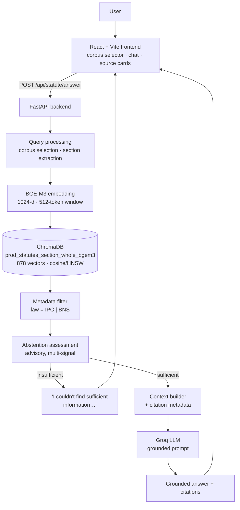
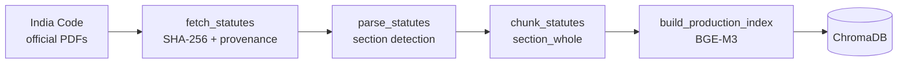
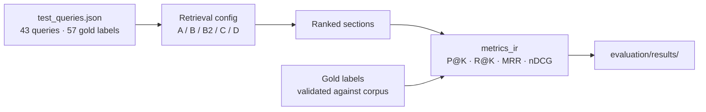

# Architecture

The production pipeline, and the differences between it and the experimental
configurations that selected it.

---

## 1. System architecture



### Request path

| Stage | Component | Notes |
| --- | --- | --- |
| Corpus selection | `services/corpus_selector.py` | Detects IPC/BNS from the query; a UI override always wins; never guesses when ambiguous |
| Embedding | `ingestion/build_index.py::get_model` | `BAAI/bge-m3`, 1024-d, no instruction prefix, 512-token cap |
| Retrieval | `services/statute_rag.py::retrieve` | Dense only, cosine, `where={"law": …}` when a statute is identified |
| Exact-section promotion | `services/statute_rag.py::_promote_exact_section` | **Production only** — see §4 |
| Abstention | `services/abstention.py` | Advisory; a weak pre-filter, not the primary mechanism |
| Context | `services/statute_rag.py::build_context` | Numbered blocks tagged `LAW`/`SECTION`/`STATUS`/`SUPERSEDED` |
| Generation | Groq, `SYSTEM_PROMPT` | Abstention instruction, citation requirement, no invented provisions |

---

## 2. Data ingestion pipeline



Full detail in [`data_pipeline.md`](data_pipeline.md), including the IPC
currency caveat, which is the single most important limitation of this corpus.

---

## 3. Evaluation architecture



Full detail in [`evaluation.md`](evaluation.md).

---

## 4. Production vs experimental configuration

The production pipeline is **not** identical to any experimental configuration.
The differences are listed here so the saved metrics are not mistaken for
measurements of what ships.

| Aspect | Experiment (config B) | Production | Why |
| --- | --- | --- | --- |
| Chunking | `section_whole` | same | A→B lifted MRR 0.310 → 0.602 |
| Embedding | bge-m3, 1024-d | same | R@5 0.763 vs 0.662 for bge-base |
| Retrieval | dense | same | hybrid lost recall and cost ~10× latency |
| Collection | `exp_statutes_section_whole_bgem3` | `prod_statutes_section_whole_bgem3` | separate so experiments are never disturbed by a production rebuild |
| Metadata filter | none | `law = IPC \| BNS` | IPC/BNS must not be mixed |
| Exact-section promotion | **absent** | **present** | see below |
| Abstention | not applied | applied | evaluation measures ranking, not refusal |
| Candidates | 50 | 15 | evaluation needs depth for R@10; production needs latency |

### The exact-section promotion

Dense retrieval has a reproducible failure on section-number queries. For
*"What does IPC Section 420 deal with?"* it returns:

```
IPC s.40   0.514   "Offence"
IPC s.50   0.484   "Section"
IPC s.420  0.478   Cheating and dishonestly inducing delivery of property
```

The literal words "Section" and "Offence" are themselves section *titles*, and
embedding similarity has no notion that "420" is an identifier rather than a
topic. Production therefore promotes an explicitly requested section to rank 1
when it is present in the candidates. This is an exact key match on structured
metadata, not a heuristic re-ranking.

It is deliberately **excluded from the experimental configurations**, so the
numbers in `evaluation/results/` continue to describe the configurations they
were measured on. Its effect on the reported metrics is therefore zero, and the
production system performs better than config B on direct-section queries than
those numbers suggest.

### Hybrid retrieval and reranking are still reproducible

Configurations C and D remain fully implemented in
`evaluation/evaluate_retrieval.py`:

```bash
python -m evaluation.evaluate_retrieval --model bge-m3 --config C
python -m evaluation.evaluate_retrieval --model bge-m3 --config D
```

They are not the production default because, under bge-m3, D scored higher MRR
(0.669 vs 0.633) but **lower Recall@5** (0.697 vs 0.763) at roughly ten times the
latency (627 ms vs 64 ms p50).

---

## 5. IPC / BNS separation

Enforced at four layers, because answering from the wrong statute is a
substantive legal error rather than a ranking inaccuracy:

1. **Ingestion** — each section carries `law`, `legal_status`, `repealed_date`,
   `amended_up_to`; the two statutes are parsed from separate source documents
   and never merged.
2. **Retrieval** — a ChromaDB `where` filter on `law` when the query identifies a
   statute. An IPC query cannot return BNS text at all.
3. **Generation** — the system prompt forbids presenting IPC text as current law
   and forbids mixing the two.
4. **UI** — a corpus selector in the header, a per-answer disclosure line, and a
   law badge plus repeal notice on every source card.

When a query names no statute, both are searched and every result is labelled.
The system does not guess, because "what is the punishment for theft?" is a
legitimate question under either statute and silently picking one hides a choice
the reader needs to make.

---

## 6. Abstention

`services/abstention.py`. Combines five signals: peak similarity, support count,
score margin (reported, not used), corpus match, and requested-section agreement.

**Measured limitation, stated up front.** Over 38 answerable queries and 18
unanswerable probes, peak similarity does *not* separate the classes:

| | answerable | unanswerable |
| --- | ---: | ---: |
| min peak similarity | 0.4915 | — |
| max peak similarity | — | **0.5949** |

Four near-domain legal queries (divorce grounds, notice periods, stamp duty,
patent term) score above the answerable floor. No threshold can separate
overlapping distributions, so this is not a tuning problem.

Consequence: **the generation prompt is the primary abstention mechanism**, and
the similarity check is a cheap pre-filter that catches only far-domain queries.
The `xfail` tests in `tests/test_production_pipeline.py` pin this limitation so
it cannot be quietly forgotten.

---

## 7. Security

| Concern | Mitigation |
| --- | --- |
| Context forgery | Context is only ever produced by server-side retrieval. `extra="forbid"` makes a smuggled `context_chunks` field a 422 rather than a silent drop. |
| Prompt injection | System prompt states its rules override anything in the context or question, and forbids disclosing itself. Retrieved text is government statute, not user content. |
| Error leakage | Handlers return opaque messages plus a correlation id; details go to the server log only. |
| Input validation | Query 1–2000 chars, non-blank, `top_k` 1–20, corpus in {IPC, BNS, both}. |
| Secrets | `GROQ_API_KEY` is env-only; `config.py` carries no default. |
| CORS | Restricted to the local frontend origins. |

---

## 8. Technology stack

**Backend** — Python 3.13, FastAPI, ChromaDB (cosine/HNSW), sentence-transformers
(`BAAI/bge-m3`), PyMuPDF, Groq. **Frontend** — React 18, TypeScript, Vite,
Tailwind, Zustand, axios. **Evaluation** — custom IR metrics, `rank-bm25` and
`CrossEncoder` for the experimental configurations. **Ops** — Prometheus,
OpenTelemetry, DVC, Docker Compose.
