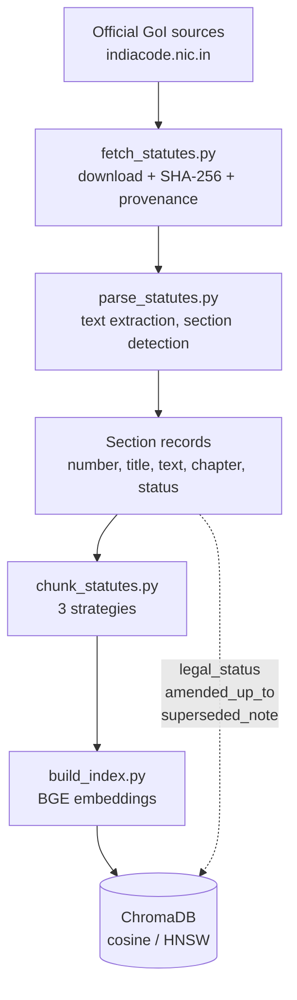
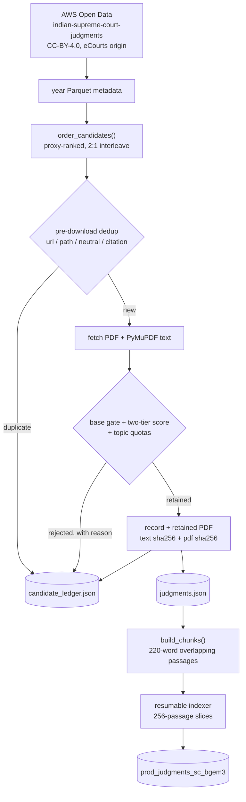

# Data Pipeline

How legal text gets from a government website into the vector index, and what is
known to be wrong with it.



---

## 1. Acquisition — `backend/ingestion/fetch_statutes.py`

Sources are declared in `backend/ingestion/sources.py`. Only official Government
of India repositories are used; `indiacode.nic.in` is maintained by the
Legislative Department, Ministry of Law and Justice.

| Doc | Act | Status | Source |
| --- | --- | --- | --- |
| `IPC` | The Indian Penal Code, 1860 (45 of 1860) | **repealed** 2024-07-01 | [India Code PDF](https://www.indiacode.nic.in/bitstream/123456789/4219/1/THE-INDIAN-PENAL-CODE-1860.pdf) |
| `BNS` | The Bharatiya Nyaya Sanhita, 2023 (45 of 2023) | **in force** from 2024-07-01 | [India Code PDF](https://www.indiacode.nic.in/bitstream/123456789/20062/1/a202345.pdf) |

Recorded per document in `data/raw/statutes/provenance.json`: source URL, act
number, publisher, SHA-256, byte size, retrieval timestamp, legal status.
Retrieval date is part of a legal citation — statutes are amended, so a reader
needs to know which version was consulted.

**Politeness.** One request per document per run, a 2-second gap between
documents, cached files skipped unless `--force`. A repeat run generates zero
traffic. TLS verification stays on, using the `certifi` bundle (the python.org
build does not read the macOS keychain).

**User-Agent.** `LawLine-AI/1.0` — an honest client identifier, deliberately not
a browser string. A longer UA carrying a parenthetical description is rejected by
the India Code WAF with HTTP 403; a short plain name is served normally.

`--verify` re-hashes the cached files against the recorded checksums.

---

## 2. ⚠️ Corpus currency — the most important caveat in this repository

**The IPC text in this corpus is a 1997-vintage consolidation.**

Verified against the file itself, not assumed:

* PDF `creationDate` = 2006-08-30
* The newest amending Act referenced anywhere in the text is from **1997**
* s.376A reads *"Intercourse by a man with his wife during separation"* — the
  **pre-2013** provision
* ss.354A–354D (sexual harassment, disrobing, voyeurism, stalking) are **absent**

It therefore does **not** incorporate:

* the **Criminal Law (Amendment) Act, 2013** (ss.354A–354D; ss.375, 376, 376A–E
  substantially rewritten)
* the **Criminal Law (Amendment) Act, 2018** (ss.376AB, 376DA, 376DB)

India Code publishes those as separate amending Acts rather than as a
consolidated current IPC, so no single official PDF carries the fully amended
text.

### How this is handled

Rather than substituting an unofficial "updated bare act" site — which would
trade a *documented* limitation for an *undocumented* one — the limitation is
carried in the data:

* every section carries `amended_up_to: "1997"`
* sections whose text is known to be superseded carry a `superseded_note`
  explaining what changed (ss.375, 376, 376A, 354, 228A)
* `legal_status` is `repealed` for all IPC sections and `in_force` for all BNS
  sections

Anything consuming this corpus must surface `legal_status` and `superseded_note`
with the citation. Presenting pre-2013 s.375 as the operative definition of rape
would be materially wrong, not merely stale.

### IPC and BNS are never merged

They are separate documents with separate statuses. The IPC is retained rather
than deleted because offences committed before 2024-07-01 continue to be tried
under it, so historical provisions remain legally relevant.

---

## 3. Parsing — `backend/ingestion/parse_statutes.py`

Yield: **523 IPC sections**, **355 BNS sections**.

The India Code PDFs are uniformly typeset — a single 10pt font throughout — so
footnotes cannot be separated from body text by font size. Two structural facts
are used instead.

**Section bodies are introduced as `<number>. <Title>.--` at line start,** with
the title repeated from the marginal note above. Two traps here, both of which
silently corrupted the corpus before they were fixed:

* Sections inserted by later amendment are wrapped in an amendment marker —
  `1*[34. Acts done by several persons…`. Anchoring naively on the section number
  drops **s.34, s.124A and s.304A** entirely.
* Titles wrap across lines (`304A. Causing death\nby\nnegligence.--`), so the
  title pattern must be DOTALL.

**Section numbers increase monotonically; footnote markers restart at 1 on every
page.** Requiring the number to advance is what rejects footnote lines such as
`1. Subs. by Act 27 of 1870, s. 2, for the original s. 40.`, which a regex alone
matches in the hundreds. A secondary guard rejects titles opening with amendment
verbs (`Subs.`, `Ins.`, `Rep.`).

**Trailing heading removal.** A section's span runs to the next section body, so
it absorbs the following section's marginal note and any cross-heading
("Of fraudulent deeds and dispositions of property"). Both are stripped, or they
would be embedded against the wrong section.

### Sections legitimately absent

Roughly 29 plain numbers in 1–511 have no operative text. Spot-checked examples:

* **s.15, s.16** — repealed in place: `[Definition of "British India".] Rep. by the A. O. 1937.`
* **ss.161–165A** — repealed from the IPC by the Prevention of Corruption Act, 1988

These are genuine repeals, not parse failures. (This is also why a test query
labelled `IPC s.161` was rejected by the gold-label validator — see
`docs/evaluation.md`.)

---

## 4. Chunking — `backend/ingestion/chunk_statutes.py`

Three strategies, so the choice can be measured rather than asserted. All consume
the same section records and emit the same record shape.

| Strategy | Chunks | Median words | Description |
| --- | ---: | ---: | --- |
| `fixed_window` | 786 | 220 | 220-word windows, 50-word overlap, **ignores section boundaries** — the control |
| `section_whole` | 878 | 98 | one chunk per section — the legally natural unit |
| `section_split` | 1,144 | 114 | section-aware; sections over 220 words split at sentence boundaries |

Budgets are counted in **whitespace words, not model tokens**, deliberately:
chunk boundaries must be identical across the embedding models being compared,
or the model comparison is confounded by a different corpus.

`section_split` prefixes every sub-chunk with its own section heading so a
fragment remains self-identifying when retrieved alone, and keeps a
`section_text` pointer to the full provision for the generator. A single
statutory sentence can exceed the cap, so a few chunks run to ~441 words.

`section_whole` and `section_split` both prepend `"<DOC> Section <N>. <Title>."`
to the embedded text — the body of s.420 never repeats the word "cheating", so
without the heading a query naming the offence cannot match it.

Sentence splitting avoids breaking on legal abbreviations (`s.`, `cl.`, `No.`,
`Rs.`, `Art.`), which would otherwise cut provisions mid-citation.

---

## 5. Embedding and indexing — `backend/ingestion/build_index.py`

One ChromaDB collection per (corpus, strategy, model): `exp_<corpus>_<strategy>_<model>`.
Cosine space, HNSW index, unit-normalised vectors.

**Context window pinned to 512 tokens for every model.** bge-m3 defaults to 8192
and bge-base to 512; leaving the defaults would confound "which model embeds
legal text better" with "which model saw more of the chunk". It is also a
practical necessity — at 8192, a batch of long sections asks the MPS backend for
a ~19.8 GiB attention buffer and the build dies with `Invalid buffer size`. The
number of chunks truncated by the cap is recorded in `index_build_stats.json`
rather than left implicit.

Build statistics — wall-clock embedding time, chunks/second, truncation counts —
are written to `evaluation/results/index_build_stats.json` on every run.

---

## 6. Judgment corpus (secondary)

13 Supreme Court, High Court and District Court judgment PDFs in `Dataset/`,
processed by `preprocessor.py` (layout-aware extraction with OCR fallback).

Two extraction bugs were fixed here:

* **Case titles were being truncated.** A lazy quantifier over a character class
  that excluded `(`, `)` and digits made the regex settle on the shortest
  right-most match, so *Justice K.S. Puttaswamy (Retd.) And Anr v. Union Of India*
  was stored as *"And Anr v. Union Of India And Ors"* across 455 chunks.
* **Court names captured the presiding judge.** The district-court fallback stored
  the whole `BEFORE THE COURT OF SH. <JUDGE>, DISTRICT JUDGE …` string, so the
  court-hierarchy multipliers never matched. It now normalises to
  `DISTRICT COURT, <CITY>`.

This corpus is **not** used for the retrieval experiments: it has no reliable
ground-truth labels, whereas a statute query has an unambiguous correct section.

---

## 7. Supreme Court criminal-law corpus — `fetch_judgments.py` → `index_judgments_resumable.py`

Separate from §6 and from the statute pipeline. This is the corpus the judgment
retrieval collection is built from.



**Selection** is documented in [corpus_selection.md](corpus_selection.md) — source,
thresholds, topic floors and ceilings, strata, and why the title proxy orders
downloads but never excludes a candidate.

**Everything is additive.** The first version of the harvester started from an
empty list each run and overwrote `judgments.json`, so a second run destroyed the
first one's corpus. It now loads the existing corpus, never rewrites a record it
did not create, and appends. The candidate ledger records every judgment ever
examined with the reason it was kept or rejected, so a re-run never re-downloads
a known reject.

**Duplicates** are caught on five keys — source URL, `(year, pdf path)`, neutral
citation, official citation, and SHA-256 of the extracted text. The first four
are checked before downloading. This is not theoretical: the source dataset
repeats rows, and the readiness check confirms all 50 repeated `case_id` pairs in
the cached years are flagged.

**Retained PDFs are kept** under `data/raw/judgments/pdf/year=YYYY/`, each with
`pdf_sha256` and `pdf_bytes` on its record, so text extraction is reproducible
offline. `--verify` re-hashes every stored PDF.

**Writes are atomic** — temp file plus rename for corpus, ledger and provenance.
The previous provenance file had drifted 153k characters away from the corpus it
described, because the two were written at different times by different runs.

### Incremental indexing

Passage IDs are `<collection>:<global-index>`, and the corpus only ever grows by
appending, so existing passages keep their indices and their embeddings stay
valid. The indexer proves this rather than assuming it: on startup it reads the
IDs already in ChromaDB, treats a slice as done only when every ID is present
**and** the stored documents match the freshly built chunks, and embeds the rest.

The previous version accepted a checkpoint only when
`checkpoint["total"] == len(chunks)`. Adding one judgment changed the total and
re-embedded all 17,342 existing passages — about 72 minutes of MPS work for
nothing.

```bash
python -m backend.ingestion.index_judgments_resumable --plan     # what would run
./scripts/index-judgments.sh                                     # start (background)
./scripts/index-status.sh                                        # progress
./scripts/index-stop.sh                                          # safe stop
```

Interrupting is safe at any point: the current slice finishes, the checkpoint is
written atomically, and `--resume` continues. Cost of a stop is at most one
slice.
